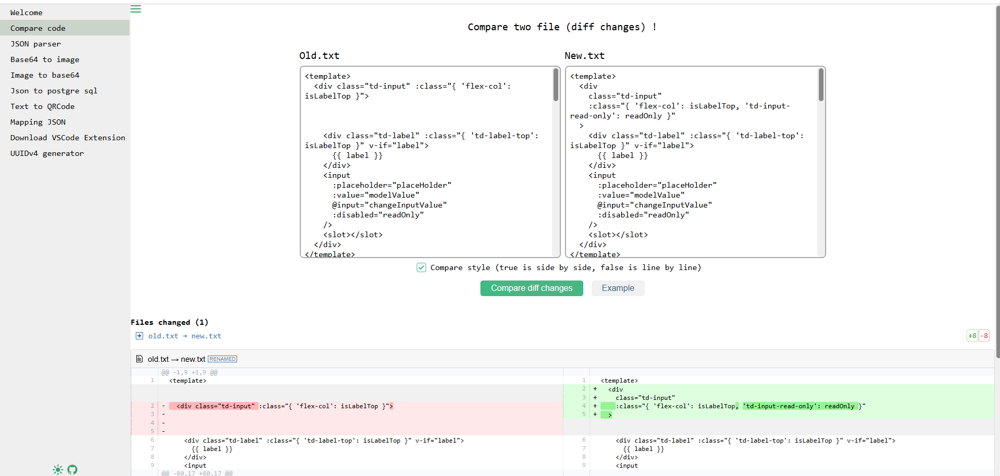
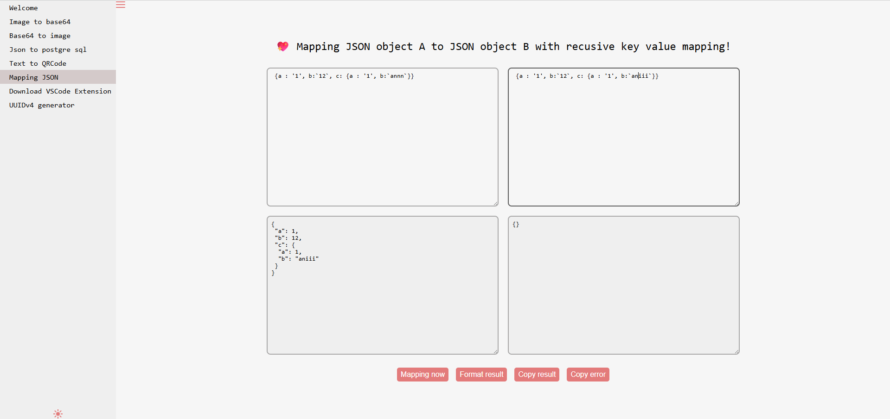

# project chứa các tool tiện ích cho dev, được tổng hợp nhằm mục đích tránh phải deploy mỗi tool lên 1 site khác nhau

có 2 phiên bản được support: phiên bản web (vue + vite) và phiên bản app (electron + vue + vite)

demo 1 số tính năng





config của toàn bộ ứng dụng có thể truy cập thông qua việc enter lệnh sau ở cửa sổ console

```
window.__env
```

các object global được inject trong file renderer.js, vd $tdCache = import TDCache.js, $tdEnum = import TDEnum.js

file [mock.js](src/mock/mock.js) sẽ được dùng để fake data cho từng tool
