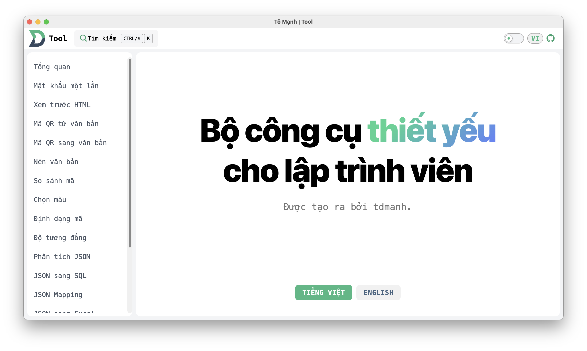
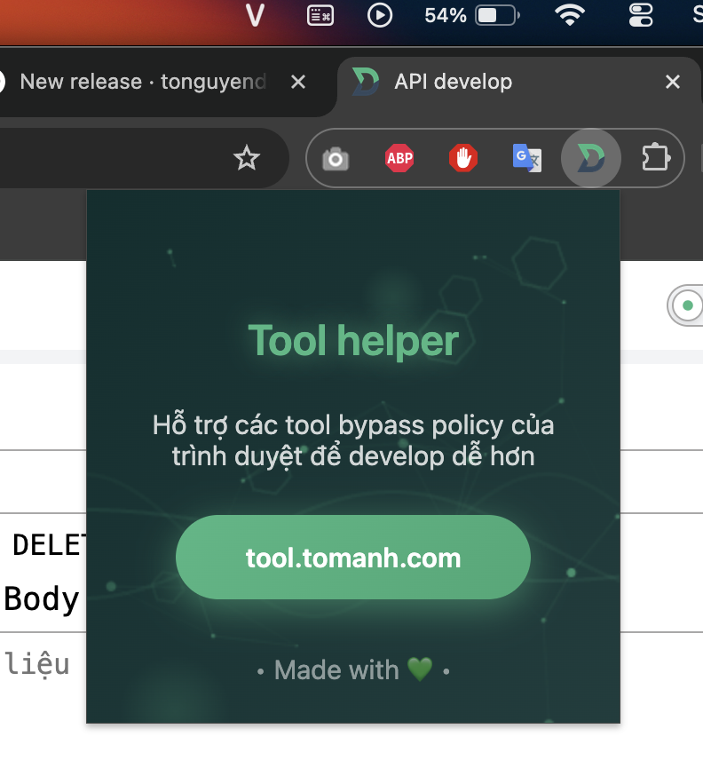

## Project: Developer Utility Tools - Aggregated to Avoid Deploying Each Tool on a Separate Site

This project provides a collection of useful tools for developers, aggregated with the aim of avoiding the need to deploy each tool on a separate website.

Two versions are supported: web version (Vue + Vite) and app version (Electron + Vue + Vite).

[https://tool.tomanh.com/](https://tool.tomanh.com/)

Demo:



To setup this project

```
npm i
```

To Run and Build project local

For web version

```
npm run web:dev
```

```
npm run web:build
```

For desktop version

```
npm run electron:dev
```

```
npm run electron:build
```

For macos

```
npm run electron:build_mac
```

extension chrome for better tooling

(must download and install to chrome for api testing without block CORS)

[src/extension/toolapi/](src/extension/toolapi)


