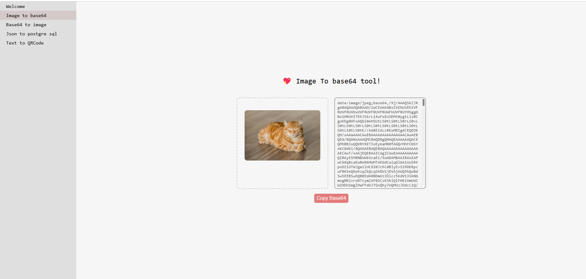
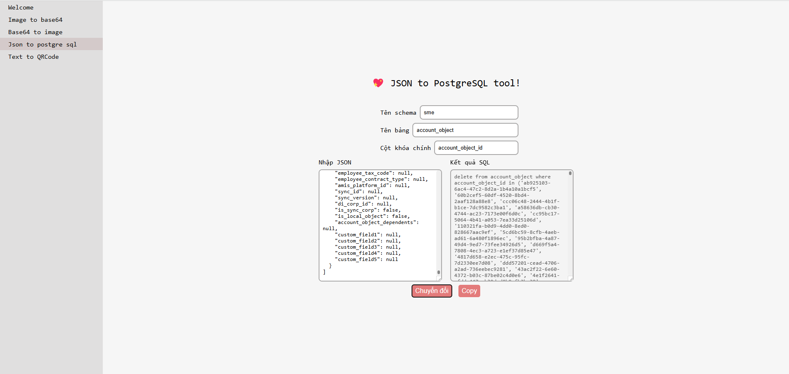
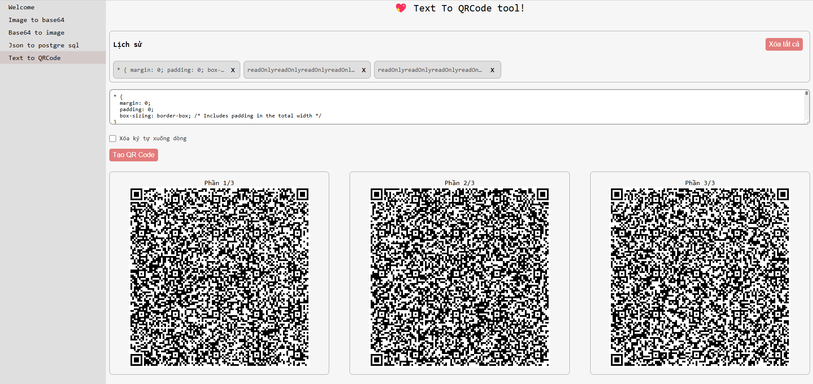
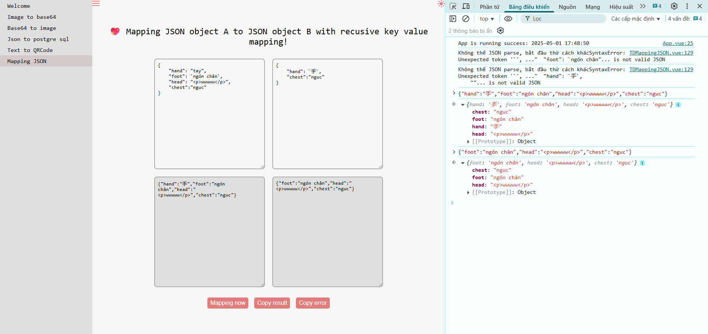

# project chứa các tool tiện ích cho dev, được tổng hợp nhằm mục đích tránh phải deploy mỗi tool lên 1 site khác nhau

có 2 phiên bản được support: phiên bản web (vue + vite) và phiên bản app (electron + vue + vite)

demo tính năng convert ảnh sang base 64



demo convert json sang câu lệnh insert postgressql



demo tính năng convert text sang nhiều mã qr



demo tính năng mapping value theo key của 2 object với nhau ( có xử lý đệ quy nếu là object lồng object )



để chạy ở phiên bản web máy dev

```
npm run web:dev
```

để build ở phiên bản web

```
npm run web:build
```

để chạy ở phiên bản app máy dev

```
npm run electron:start
```

để build ở phiên bản app

```
npm run electron:package
```

config của toàn bộ ứng dụng có thể truy cập thông qua việc enter lệnh sau ở cửa sổ console

```
window.__env
```

các object global được inject trong file renderer.js, vd $tdCache = import TDCache.js, $tdEnum = import TDEnum.js
