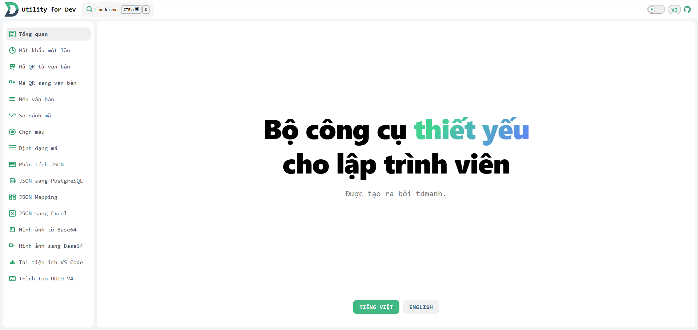

## Project: Developer Utility Tools - Aggregated to Avoid Deploying Each Tool on a Separate Site

This project provides a collection of useful tools for developers, aggregated with the aim of avoiding the need to deploy each tool on a separate website.

Two versions are supported: web version (Vue + Vite) and app version (Electron + Vue + Vite).

[https://tool.tomanh.com/](https://tool.tomanh.com/)

List of Supported Features:

One time password, Color picker, Text Compress, Compare code, JSON parser, JSON to PostgreSQL, JSON Mapping, JSON to Excel, Code formatter, Image from Base64, Image to Base64, QRCode from text, QRCode to text, Download VSCode Extension, UUIDv4 generator

List of Supported languages: Vietnamese, English

Demo:



Application-wide configuration can be accessed by entering the following command in the console:

```
window.__env
```

Global objects are injected in the `renderer.js` file, for example: `$tdCache = import TDCache.js`, `$tdEnum = import TDEnum.js`.

The `[mock.js](src/common/mock/mock.js)` file will be used to fake data for each tool.

To setup this project

```
npm i
```

To Run and Build project local

For web version

```
npm run web:dev
```

```
npm run web:build
```

For desktop version

```
npm run electron:dev
```

```
npm run electron:build
```

Để build các source liên quan tới wasm, vui lòng vào folder wasm, build project,

sau đó làm theo hướng dẫn và copy folder đã build vào thư mục public

lưu ý: tạm thời chỉ có 2 file là dotnet.js và dotnet.js.map là để ở public/\_framework khi triển khai,
còn các file còn lại ném hết vào public/assets khi triển khai, tạm thời chưa dựng cơ chế khi buid nên move vào folder nào
