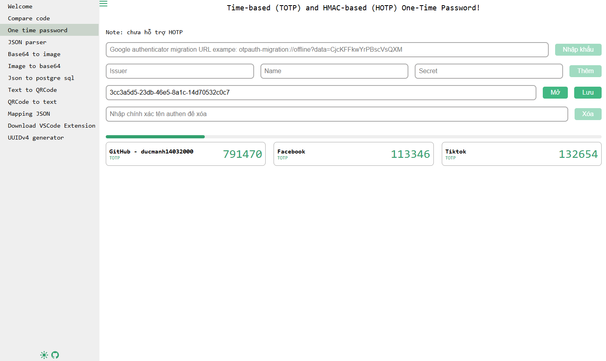

## Project: Developer Utility Tools - Aggregated to Avoid Deploying Each Tool on a Separate Site

This project provides a collection of useful tools for developers, aggregated with the aim of avoiding the need to deploy each tool on a separate website.

Two versions are supported: web version (Vue + Vite) and app version (Electron + Vue + Vite).

List of Supported Features:

```
"One time password",
"Text Compress",
"Compare code",
"JSON parser",
"JSON to pPostgreSQL",
"JSON Mapping",
"JSON to Excel",
"Image from Base64",
"Image to Base64",
"QRCode from text",
"QRCode to text",
"Download VSCode Extension",
"UUIDv4 generator"
```

Feature Demos:



Application-wide configuration can be accessed by entering the following command in the console:

```
window.__env
```

Global objects are injected in the `renderer.js` file, for example: `$tdCache = import TDCache.js`, `$tdEnum = import TDEnum.js`.

The `[mock.js](src/common/mock/mock.js)` file will be used to fake data for each tool.
