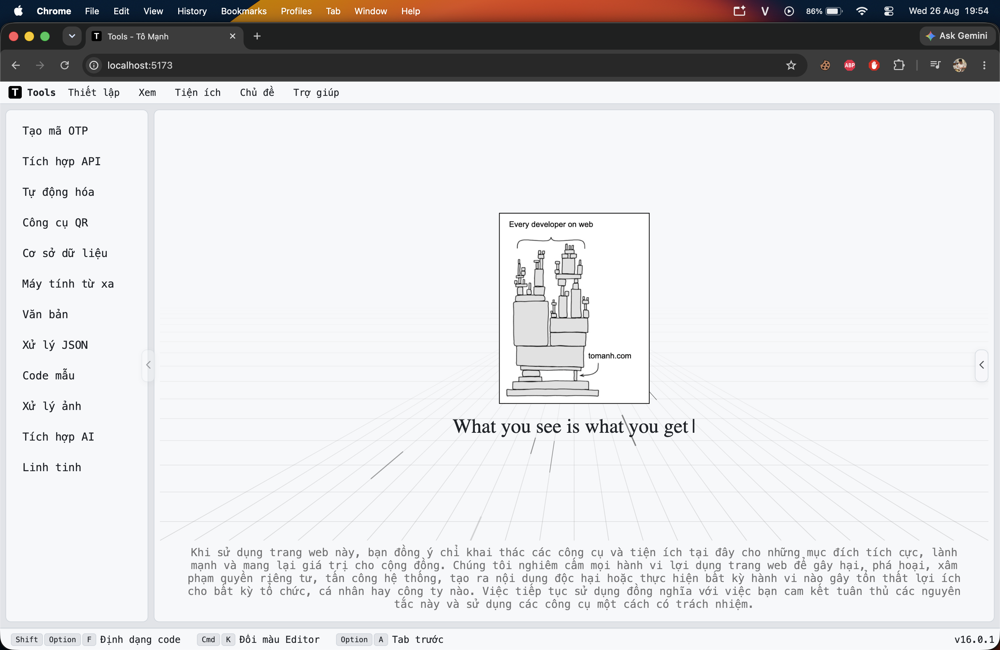

## Dự án: Công cụ Tiện ích cho Lập trình viên - Tổng hợp để tránh triển khai mỗi công cụ trên một trang web riêng biệt

Dự án này cung cấp một bộ sưu tập các công cụ hữu ích dành cho lập trình viên, được tổng hợp với mục tiêu tránh phải triển khai mỗi công cụ trên một trang web riêng biệt.

Đây là một **Ứng dụng Client-Daemon**.



🔗 [https://tomanh.com/](https://tomanh.com/)

---

## Cài đặt

### 1. Clone & Submodules

Dự án này sử dụng **Git Submodules** cho các phụ thuộc bên ngoài (ví dụ: IronRDP). Để clone dự án cùng với toàn bộ mã nguồn cần thiết, sử dụng:

```bash
# Clone repository
git clone --recursive https://github.com/tonguyenducmanh/devtools.git
cd your-main-repo

# Nếu bạn đã clone mà không có submodules, chạy lệnh:
git submodule update --init --recursive

npm i
```

## Chạy Dự án

### Phiên bản Web (Frontend)

```bash
npm run dev
npm run build
```

### API / Daemon (Backend)

Để build tất cả các dịch vụ backend:

```bash
chmod 777 ./build_all.sh
./build_all.sh
```

## Cấu hình

Các dịch vụ backend được cấu hình hoặc mặc định thông qua `config/config.json`.

Cấu hình dành riêng cho Frontend có thể tìm thấy tại: `src/cfg/config.js` (được bundle vào entry chunk khi build, không cần config realtime).

### Lưu trữ Dữ liệu (SQLite)

Công cụ này sử dụng **SQLite** (phía Go) để lưu trữ dữ liệu vào một file cục bộ.

- **File Cơ sở dữ liệu**: `dev_tool.db` (như định nghĩa trong `config.json`)
- Tất cả cấu hình, mock API do người dùng định nghĩa, và dữ liệu riêng của từng công cụ đều được lưu trong file này.
- SQLite được sử dụng để đảm bảo tính di động và dễ sao lưu — mọi thứ đều nằm trong thư mục cục bộ của bạn.

## WebAssembly

Thư mục dưới đây chứa nhiều công cụ được viết bằng các ngôn ngữ khác và biên dịch thành wasm để chạy trên ứng dụng web.

[Thư mục Web Assembly](src_wasm)
