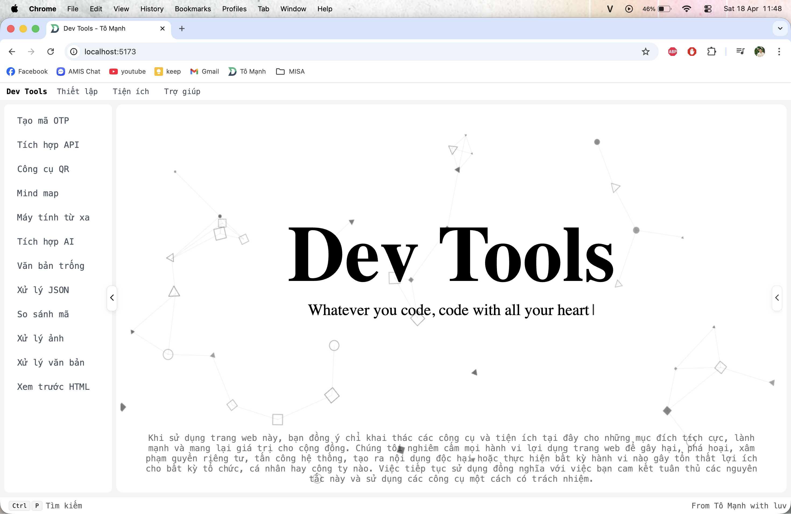

## Dự án: Công cụ Tiện ích cho Lập trình viên - Tổng hợp để tránh triển khai mỗi công cụ trên một trang web riêng biệt

Dự án này cung cấp một bộ sưu tập các công cụ hữu ích dành cho lập trình viên, được tổng hợp với mục tiêu tránh phải triển khai mỗi công cụ trên một trang web riêng biệt.

Đây là một **Ứng dụng Client-Daemon**.



🔗 [https://tomanh.com/](https://tomanh.com/)

---

## Cài đặt

### 1. Clone & Submodules

Dự án này sử dụng **Git Submodules** cho các phụ thuộc bên ngoài (ví dụ: IronRDP). Để clone dự án cùng với toàn bộ mã nguồn cần thiết, sử dụng:

```bash
# Clone repository
git clone --recursive https://github.com/tonguyenducmanh/devtools.git
cd your-main-repo

# Nếu bạn đã clone mà không có submodules, chạy lệnh:
git submodule update --init --recursive

npm i
```

## Chạy Dự án

### Phiên bản Web (Frontend)

```bash
npm run dev
npm run build
```

### API / Daemon (Backend)

Để build tất cả các dịch vụ backend:

```bash
chmod 777 ./build_all.sh
./build_all.sh
```

## Cấu hình

Các dịch vụ backend được cấu hình hoặc mặc định thông qua `config/config.json`.

Cấu hình dành riêng cho Frontend có thể tìm thấy tại: `public/cfg/config.js`

### Lưu trữ Dữ liệu (SQLite)

Công cụ này sử dụng **SQLite** (phía Go) để lưu trữ dữ liệu vào một file cục bộ.

- **File Cơ sở dữ liệu**: `dev_tool.db` (như định nghĩa trong `config.json`)
- Tất cả cấu hình, mock API do người dùng định nghĩa, và dữ liệu riêng của từng công cụ đều được lưu trong file này.
- SQLite được sử dụng để đảm bảo tính di động và dễ sao lưu — mọi thứ đều nằm trong thư mục cục bộ của bạn.

## WebAssembly

Thư mục dưới đây chứa nhiều công cụ được viết bằng các ngôn ngữ khác và biên dịch thành wasm để chạy trên ứng dụng web.

[Thư mục Web Assembly](src_wasm)

## Kiểm thử tự động (Auto Test)

Dự án áp dụng quy trình kiểm thử tự động (E2E) dựa trên **JSON Schema** và **Playwright**. Thay vì viết code script thủ công, QC/BA hoặc AI sẽ viết kịch bản bằng file JSON, sau đó hệ thống tự động sinh ra mã Playwright.

### 1. Chuẩn bị
Đảm bảo bạn đã cài đặt các công cụ cần thiết cho Playwright:
```bash
npm install
npx playwright install
```

### 2. Các lệnh kiểm thử (NPM Scripts)
- `npm run test`: Chạy toàn bộ các file test (sẽ bật cửa sổ trình duyệt Chromium để bạn có thể xem trực tiếp automation thao tác).
- `npm run test:ui`: Mở giao diện **Playwright UI** chuyên dụng, hỗ trợ debug, step-over và xem lại quá trình test.

### 3. Quy trình Kiểm thử (Workflow)
1. **Tạo kịch bản (JSON Schema):** 
   Tạo file `.schema.json` trong thư mục `test/schemas/`. 
   *(Mẹo: Bạn có thể đưa file `test/prompts/system_prompt.md` kèm theo tài liệu PBI cho ChatGPT/AI để nó tự động sinh ra file JSON này chuẩn xác)*.
2. **Kiểm tra Data-TestID:** 
   Developer cần đảm bảo các thẻ `data-testid` sinh ra trong JSON đã được cấy vào mã nguồn Vue.js. Chạy lệnh sau để kiểm tra xem dev có cấy thiếu chỗ nào không:
   ```bash
   ./scripts/test_check_testids.sh test/schemas/<tên-file>.schema.json src/
   ```
3. **Sinh mã Playwright tự động:** 
   Bộ công cụ sẽ tự parse file JSON thành file TypeScript (`.spec.ts`):
   ```bash
   ./scripts/test_gen_playwright.sh test/schemas/<tên-file>.schema.json test/generated/
   ```
4. **Thực thi:** Đảm bảo app đang chạy ở local (bằng `npm run dev`), sau đó chạy `npm run test`. Playwright sẽ giả lập người dùng click mở tool ở sidebar, nhập liệu và kiểm tra kết quả.

*Lưu ý: Plugin Vite (`strip-data-testid`) đã được cấu hình để tự động xóa toàn bộ các thuộc tính `data-testid="..."` khi build production, do đó nó hoàn toàn không làm rác HTML hay ảnh hưởng đến hiệu năng của bản Release.*

---

## Các Script Tiện Ích (Utility Scripts)

Dự án cung cấp sẵn một số kịch bản bash shell (nằm trong thư mục `scripts/`) giúp tự động hoá quá trình build, test và dọn dẹp hệ thống. Để sử dụng, bạn có thể cấp quyền thực thi (nếu cần: `chmod +x scripts/*.sh`) và gọi trực tiếp từ Terminal:

### 1. Build & Đóng gói (Build & Release)
- **`./scripts/build_api.sh`**: Biên dịch phần Go API backend (`cmd/api_app`) ra file thực thi cho môi trường (Mac, Windows, Linux...).
- **`./scripts/build_daemon.sh`**: Biên dịch Daemon Service, tự động đọc phiên bản từ `package.json` để nhúng vào binary.
- **`./scripts/build_wasm.sh`**: Khởi chạy quá trình biên dịch toàn bộ các module WebAssembly (bao gồm Rust IronRDP và các Wrapper .NET) để frontend có thể load và sử dụng.
- **`./scripts/build_web_for_daemon.sh`**: Tự động build source Vue.js Frontend (thông qua Vite) và copy file tĩnh vào đúng thư mục của hệ thống backend daemon để host.

### 2. Auto Test (Playwright E2E)
- **`./scripts/test_validate.sh <schema.json>`**: Kiểm tra tính hợp lệ của cú pháp file JSON Flow Schema trước khi gen.
- **`./scripts/test_check_testids.sh <schema.json> [src_dir]`**: Quét nhanh thư mục `src/` để đảm bảo Dev đã cấy đủ 100% các `data-testid` được mô tả trong Schema.
- **`./scripts/test_gen_playwright.sh <schema.json> [out_dir]`**: Tự động parse JSON Schema và sinh ra file `.spec.ts` tương ứng để Playwright chạy.

### 3. Dọn dẹp hệ thống (Clean up)
- **`./scripts/remove_all_db_file.sh`**: Quét và xoá toàn bộ các file `dev_tool.db` (SQLite) sinh ra trong dự án để reset lại trạng thái database gốc.
- **`./scripts/remove_old_tag.sh`**: Xoá bớt các Git Tags cũ ở môi trường Local (chỉ giữ lại những version cấu hình trong mảng `EXCLUDE_TAGS`) nhằm làm nhẹ repository.
