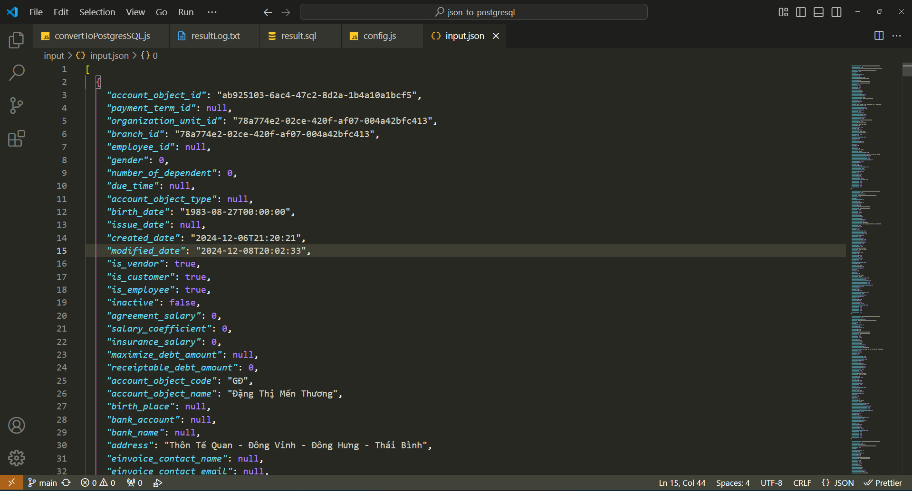
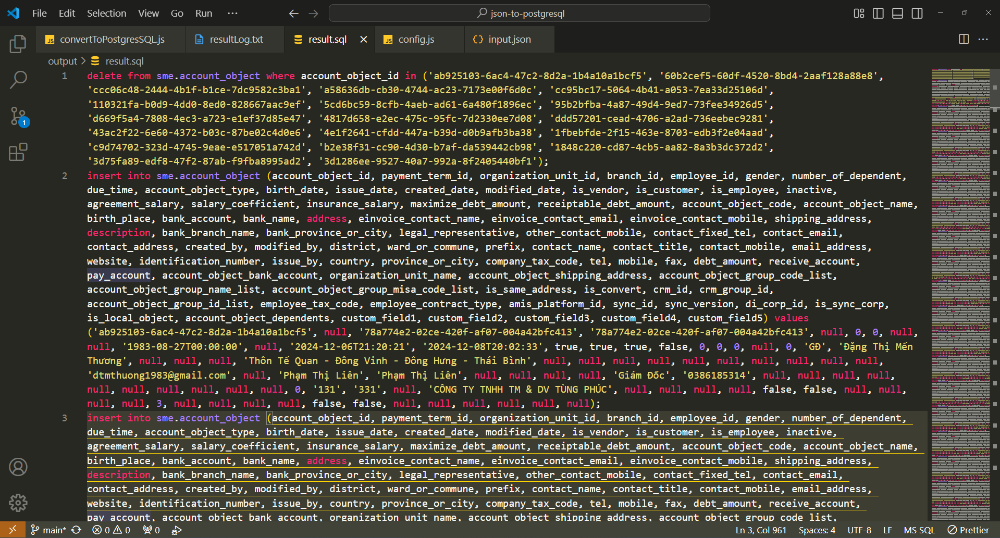
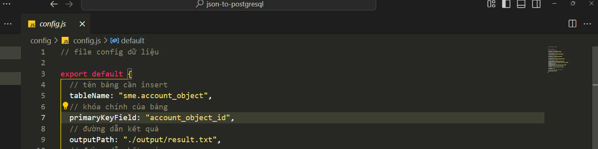

# project convert dữ liệu json thành câu lệnh insert vào database postgresql

ví dụ input đầu vào ( có thể là 1 object hoặc 1 mảng object)

demo bản web

demo bản nodejs

kết quả trả về

tên bảng và khóa chính sẽ được cấu hình ở file dưới

bổ sung script tạo bảng theo cấu hình trong file config nếu muốn

