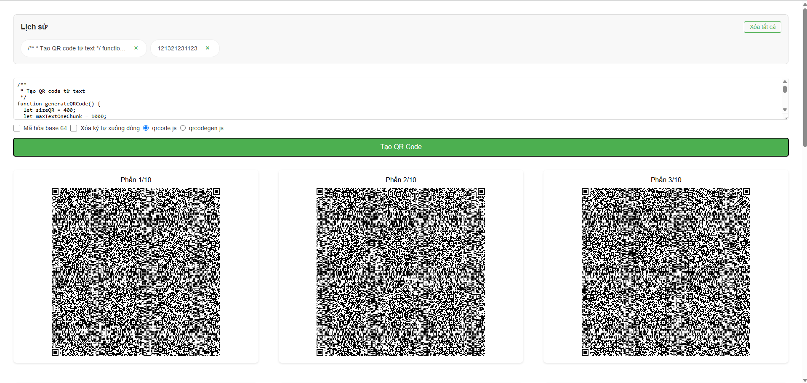

# Text-to-QR Code Generator

Một ứng dụng web đơn giản để chuyển đổi văn bản thành mã QR code, được xây dựng bằng HTML, CSS và JavaScript thuần.

## Tính năng chính

- 🔄 Chuyển đổi văn bản thành mã QR code theo thời gian thực
- 📏 Tự động chia văn bản dài thành nhiều mã QR (mỗi mã chứa tối đa 1000 ký tự)
- 💾 Tải xuống mã QR dưới dạng hình ảnh
- 📱 Giao diện responsive, hoạt động tốt trên mọi thiết bị
- 📜 Lưu lịch sử 10 mã QR gần nhất

## Công nghệ sử dụng

- HTML5
- CSS3 (Grid Layout, Flexbox)
- JavaScript (ES6+)
- Thư viện QR Code:
  - qrcode.js
  - qrcodegen.js

## Cách sử dụng

1. Mở file `index.html` trong trình duyệt web
2. Nhập văn bản vào ô input
3. Mã QR sẽ được tự động tạo ra
4. Với văn bản dài (trên 1000 ký tự), hệ thống sẽ tự động chia thành nhiều mã QR

## Tối ưu hiệu năng

- Sử dụng debounce để tránh tạo QR code quá nhiều lần
- Xử lý văn bản theo chunks để tối ưu bộ nhớ
- Batch DOM updates để giảm thiểu reflow/repaint

## Browser Support

- Chrome (phiên bản mới nhất)
- Firefox (phiên bản mới nhất)
- Safari (phiên bản mới nhất)
- Edge (phiên bản mới nhất)

## Đóng góp

Mọi đóng góp đều được chào đón. Vui lòng tạo issue hoặc pull request nếu bạn muốn cải thiện ứng dụng.
