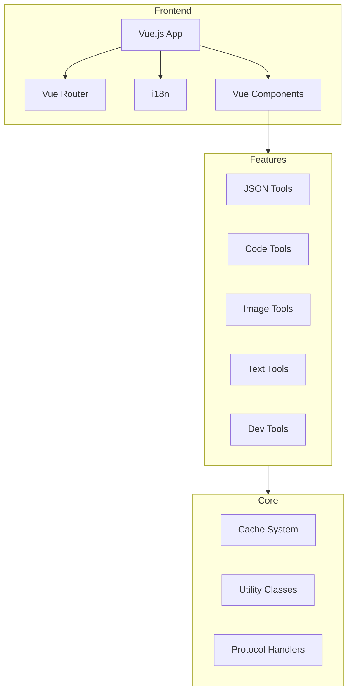
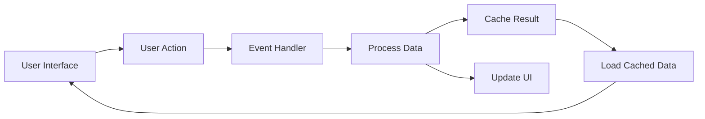

# System Patterns

## Architecture Overview



## Design Patterns

### Component Architecture
- Atomic Design Pattern cho Vue Components
- Tái sử dụng components (TDButton, TDInput, TDTextarea...)
- Props validation và events emit
- Lazy loading cho các công cụ

### Cache System
- Abstract Factory Pattern cho cache drivers
- Strategy Pattern cho việc chọn cache driver
- Adapter Pattern cho các loại storage (IndexDB, InMemory)

### Utility System
- Singleton Pattern cho các utility classes
- Factory Method cho việc tạo instances
- Observer Pattern cho event handling

## File Structure
```
src/
├── common/         # Core utilities và shared logic
│   ├── cache/      # Cache system
│   ├── color/      # Color utilities
│   ├── compress/   # Compression logic
│   ├── mock/       # Tool implementations
│   ├── proto/      # Protocol handlers
│   └── qrcode/     # QR code utilities
├── components/     # Reusable Vue components
├── i18n/          # Internationalization
├── router/        # Route definitions
├── styles/        # Global styles
└── views/         # Page components
    └── tools/     # Individual tool views
```

## Key Technical Decisions

### Frontend
- Vue.js làm frontend framework
- Vue Router cho routing
- SCSS cho styling
- i18n cho đa ngôn ngữ

### Storage
- IndexedDB cho persistent storage
- In-memory cache cho performance
- Local storage cho user preferences

### Tooling
- Vite cho development và build
- ESLint cho code linting
- Prettier cho code formatting

## Data Flow



## Error Handling
- Try-catch wrapper cho các operations
- Error boundary cho Vue components
- Custom error types cho specific cases
- Thông báo lỗi người dùng thân thiện

## Security Considerations
- Không lưu trữ dữ liệu nhạy cảm
- Sanitize input data
- Offline-first approach
- Cross-site scripting (XSS) prevention
